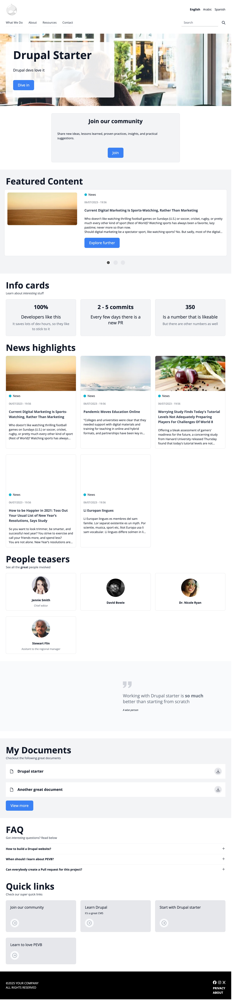
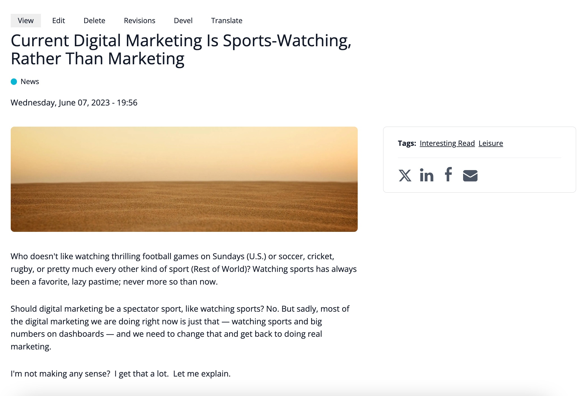
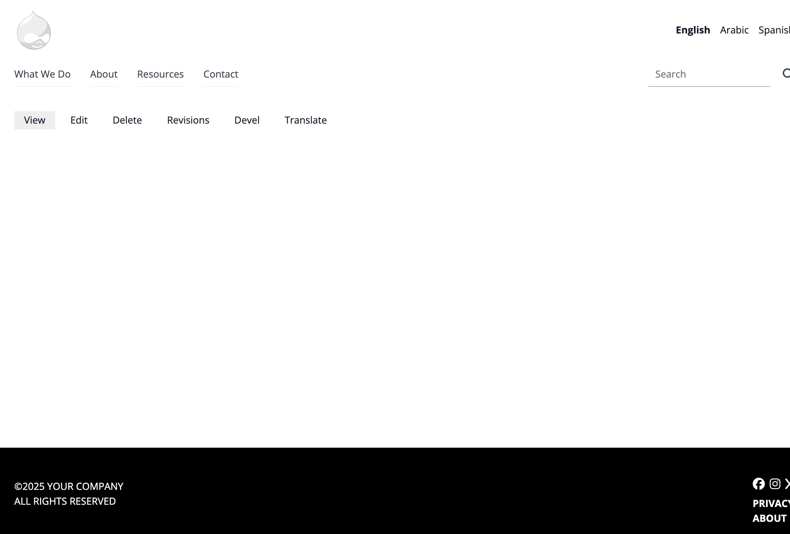
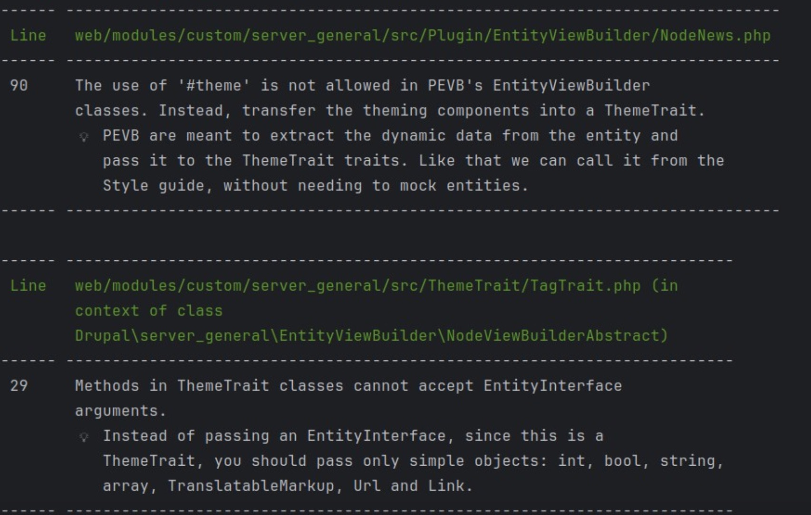

---

_`Pluggable Entity View Builder and the Amazing Drupal-Starter`_

<div style="display: block; font-size: 0.7em; margin-top: 2em; color: darkgrey;">https://github.com/gizra/drupal-starter<div>

<div style="display: block; font-size: 0.7em; margin-top: 2em; color: darkgrey;">@amitaibu</div>

---

<div style="max-height: 600px; overflow-y: auto;">
  
</div>

---


---

## My Goals

- ✅ Easy maintenance
- ✅ Easy to jump between projects
- ✅ Familiarity and consistency
- ✅ Easy copy/paste
- ✅ No “Where is this element coming from?”

---

## Creating and Theming a Paragraph

Time breakdown for a typical new Paragraph:

- 🧱 Create Paragraph type: **~1h**
- 🧪 Copy/paste automatic tests: **~0.5h**
- 🎨 Theming: **~4h**

*Theming is the time-consuming part*

---


---

<pre><code data-trim class="language-php" data-line-numbers>
# src/ThemeTrait/CtaThemeTrait.php

protected function buildElementCta(string $title, array $body, Link $link): array {
    $elements = [];

    // Title.
    $element = $title;
    $element = $this->wrapTextResponsiveFontSize($element, '3xl');
    $element = $this->wrapTextCenter($element);
    $elements[] = $this->wrapTextFontWeight($element, 'bold');

    // Text.
    $elements[] = $this->wrapProseText($body);

    // Button.
    $elements[] = $this->buildButton($link->getText(), $link->getUrl(), 'primary', NULL, $link->getUrl()->isExternal());

    $elements = $this->wrapContainerVerticalSpacingBig($elements, 'center');

    $elements = $this->buildInnerElementLayout($elements, 'light-gray');
    return $this->wrapContainerNarrow($elements);
}
</code></pre>

---

```
https://drupal-starter.ddev.site:4443/style-guide
```


---

## Reasoning with Twig Files

- 🧠 Lower the effort of **mental modeling**
- 📄 What you see in the Twig is what you get
- 🔄 Predictable structure

---

```bash
server-theme-staff-card.html.twig
```


---

<pre><code data-trim class="language-twig" data-line-numbers>
# server-theme-text-decoration--italic.html

<div class="italic">
  {{ element }}
</div>
</code></pre>

---

<pre><code data-trim class="language-twig" data-line-numbers>
# server-theme-text-decoration--center.html.twig

<div class="text-center">
  {{ element }}
</div>

</code></pre>

---

<pre><code data-trim class="language-twig" data-line-numbers>
# server-theme-text-decoration--font-weight.html.twig


  

  

  


<div class="{{ weight_class }}">
  {{ element }}
</div>


</code></pre>

---

<pre><code data-trim class="language-twig" data-line-numbers>
# server-theme-text-decoration--responsive-font-size.html.twig


  

  

  

  

  

  

  


<div class="{{ size_classes }}">
  {{ element }}
</div>


</code></pre>

---

<pre><code data-trim class="language-twig" data-line-numbers>
# server-theme-container-vertical-spacing.html.twig


  
  {{ classes }}

<div class="{{ _self.getClass(align) }}">
  {{ items }}
</div>

</code></pre>

---

<pre><code data-trim class="language-twig" data-line-numbers>
# server-theme-container-narrow.html.twig






  


<div class="{{ color_class }} {{ py_class }}">
  <div class="container-narrow w-full">
    {{ element }}
  </div>
</div>

</code></pre>

---

<pre><code data-trim class="language-php" data-line-numbers>
# src/ThemeTrait/ElementWrapThemeTrait.php

protected function wrapContainerNarrow(array $element, ?string $bg_color = NULL): array {
  $element = $this->filterEmptyElements($element);
  if (empty($element)) {
    // Element is empty, so no need to wrap it.
    return [];
  }

  return [
    '#theme' => 'server_theme_container_narrow',
    '#element' => $element,
    '#bg_color' => $bg_color,
  ];
}

</code></pre>

---

<pre><code data-trim class="language-php" data-line-numbers>
# src/ThemeTrait/CtaThemeTrait.php

protected function buildElementCta(string $title, array $body, Link $link): array {
    $elements = [];

    // Title.
    $element = $title;
    $element = $this->wrapTextResponsiveFontSize($element, '3xl');
    $element = $this->wrapTextCenter($element);
    $elements[] = $this->wrapTextFontWeight($element, 'bold');

    // Text.
    $elements[] = $this->wrapProseText($body);

    // Button.
    $elements[] = $this->buildButton($link->getText(), $link->getUrl(), 'primary', NULL, $link->getUrl()->isExternal());

    $elements = $this->wrapContainerVerticalSpacingBig($elements, 'center');

    $elements = $this->buildInnerElementLayout($elements, 'light-gray');
    return $this->wrapContainerNarrow($elements);
}
</code></pre>

---

```
https://drupal-starter.ddev.site:4443/style-guide#element-quote
```


---

## Two Types of Twig Files

- 🎨 **Styling Twig**:
  Applies **visual styles**
  _e.g. spacing, font size, color, alignment, flex_

- 🧱 **Layout Twig** *(rare)*:
  Defines **layout** and **position**
  _e.g. two columns_

---

<pre><code data-trim class="language-php" data-line-numbers>
# src/ThemeTrait/QuoteThemeTrait.php

protected function buildElementQuote(array $image, array $quote, ?string $subtitle = NULL, ?string $image_credit = NULL): array {
  $items = [];

  // Quotation sign.
  $items[] = ['#theme' => 'server_theme_quotation_sign'];

  // Quote.
  $element = $this->wrapTextResponsiveFontSize($quote, '2xl');
  $items[] = $this->wrapTextColor($element, 'gray');

  // Quote by.
  $element = $this->wrapTextResponsiveFontSize($subtitle, 'sm');
  $items[] = $this->wrapTextItalic($element);

  // The photo credit on top of the image.
  $credit = [];
  if (!empty($image_credit)) {
    $credit[] = ['#markup' => '© ' . $image_credit];
  }

  return [
    '#theme' => 'server_theme_element_layout__split_image_and_content',
    '#items' => $this->wrapContainerVerticalSpacing($items),
    '#image' => $image,
    '#credit' => $credit,
  ];
}
</code></pre>

---

<pre><code data-trim class="language-twig" data-line-numbers="3-10|3,10|4-7|9">
# server-theme-element-layout--split-image-and-content.html.twig

<div>
  <div>
    <div>{{ image }}</div>
    <div>{{ credit }}</div>
  </div>

  <div>{{ items }}</div>
</div>

</code></pre>

---

<pre><code data-trim class="language-twig" data-line-numbers>
# server-theme-element-layout--split-image-and-content.html.twig

<div class="flex flex-col sm:grid sm:grid-rows-1 md:grid-cols-2 gap-2 md:gap-8 lg:gap-10 overflow-hidden bg-gray-50">

  {#
  We use grid and row/col start to position both the image and the text on
  the same cell.
  #}
  <div class="w-full grid grid-rows-1">
    <figure class="row-start-1 col-start-1 child-object-cover h-full">
      {{ image }}
    </figure>

    
      <div class="row-start-1 col-start-1 self-end h-fit w-fit text-xs bg-white opacity-70 p-2">
        {{ credit }}
      </div>
    
  </div>

  <div class="pt-5 pb-8 px-5 lg:py-8 lg:max-w-lg my-auto">
    {{ items }}
  </div>
</div>

</code></pre>

---

## "Where Is This Element Coming From?"

- 🧩 A **Block**?
  Check block visibility settings?

- 🎛 A **Formatter**?
  Maybe custom logic in the display config?

- 🧙‍♂️ **Preprocessed**?
  Data massaged via `hook_preprocess_*`?

- 🕵️‍♂️ **Inspecting the CSS class**
  …just to guess which template or source it came from

Note: 😵‍💫 Too much reverse-engineering

---

## PEVB Controls Everything (via Code)

- 🧱 No **Layout Manager modules**
- 🧩 No **Field UI** for field order
- 🪄 No **hooks** or **preprocess** magic

---

## PEVB Controls Everything (via Code)

- ✅ **PEVB** fetchs the data
- ✅ Passes to `ThemeTrait`s for display
- ✅ If it looks right on the style guide, it’s right

---



---

<pre><code data-trim class="language-php" data-line-numbers>
# src/Plugin/EntityViewBuilder/NodeNews.php

public function buildFull(array $build, NodeInterface $entity) {
  return $build;
}
</code></pre>

---




---

<pre><code data-trim class="language-php" data-line-numbers>
# src/Plugin/EntityViewBuilder/NodeNews.php

public function buildFull(array $build, NodeInterface $entity) {
  // The node's label.
  $node_type = $this->entityTypeManager->getStorage('node_type')->load($entity->bundle());
  $label = $node_type->label();

  // The hero responsive image.
  $medias = $entity->get('field_featured_image')->referencedEntities();
  $image = $this->buildEntities($medias, 'hero');

  $element = $this->buildElementNodeNews(
    $entity->label(),
    $label,
    $this->getFieldOrCreatedTimestamp($entity, 'field_publish_date'),
    $image,
    $this->buildProcessedText($entity),
    $this->buildTags($entity),
    $this->buildSocialShare($entity),
  );

  $build[] = $element;

  return $build;
}
</code></pre>

---
<pre><code data-trim class="language-php" data-line-numbers>
# src/ThemeTrait/ElementNodeNewsThemeTrait.php

protected function buildElementNodeNews(string $title, string $label, int $timestamp, array $image, array $body, array $tags, array $social_share): array {
  $elements = [];

  // Header.
  $element = $this->buildHeader(
    $title,
    $label,
    $timestamp
  );
  $elements[] = $this->wrapContainerWide($element);

  // Main content and sidebar.
  $element = $this->buildMainAndSidebar(
    $image,
    $this->wrapProseText($body),
    $tags,
    $social_share,
  );
  $elements[] = $this->wrapContainerWide($element);

  $elements = $this->wrapContainerVerticalSpacingBig($elements);
  return $this->wrapContainerBottomPadding($elements);
}
</code></pre>

---

## Why Not Layout Builder?

- ❌ Clients don’t need full layout freedom
- ❌ Unlimited flexibility = unlimited QA surface

---

## Why Not Layout Builder?

- ✅ We provide **limited, intentional flexibility**
- ✅ Clients can **mix & match Paragraphs**
- ✅ But always within **known, tested layouts**

🧱 Design system-driven, not freeform chaos

---

1. 🧩 **Create a ThemeTrait**
   - It receives only **simple values** like `Int`, `String`, `Array`, `Url`, `Link`
   - ❌ Not `EntityInterface` objects

2. 🎨 **Add to the Style Guide**
   - Easy to preview, test, and QA

3. 🔌 **Wire it to PEVB**
   - PEVB gathers the data
   - ❌ It does **not** return `#theme` directly
   - ✅ Only the `ThemeTrait` builds render arrays

---

```bash
ddev phpstan
```



---
## Try It on Drupal-Starter

1. 📚 Gizra’s **codified knowledge base**
2. 🚀 Every new project **starts from this**
3. 🔁 We constantly **feed it back** with new learnings

👉 https://github.com/gizra/drupal-starter
