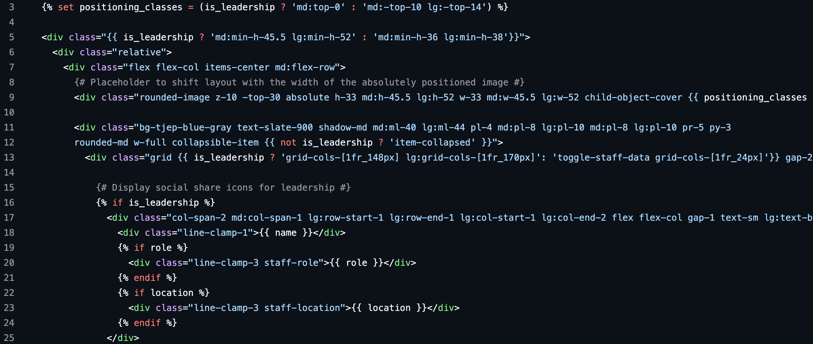
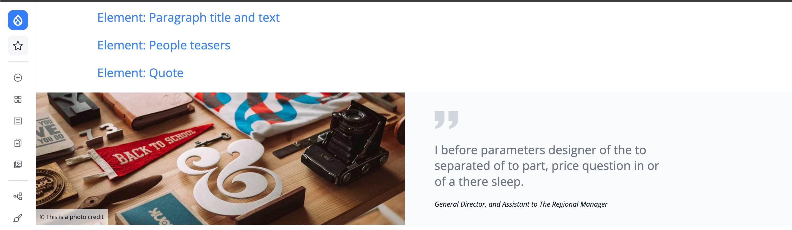

---

## My Goals

- ✅ Easy maintenance
- ✅ Easy to jump between projects
- ✅ Familiarity and consistency
- ✅ Easy copy/paste
- ✅ No “Where is this element coming from?”

---

## Creating and Theming a Paragraph

Time breakdown for a typical new Paragraph:

- 🧱 Create Paragraph type: **~1h**
- 🧪 Copy/paste automatic tests: **~0.5h**
- 🎨 Theming: **~4h**

*Theming is the time-consuming part*

---


---

<pre><code data-trim class="language-php" data-line-numbers>
protected function buildElementCta(string $title, array $body, Link $link): array {
    $elements = [];

    // Title.
    $element = $title;
    $element = $this->wrapTextResponsiveFontSize($element, '3xl');
    $element = $this->wrapTextCenter($element);
    $elements[] = $this->wrapTextFontWeight($element, 'bold');

    // Text.
    $elements[] = $this->wrapProseText($body);

    // Button.
    $elements[] = $this->buildButton($link->getText(), $link->getUrl(), 'primary', NULL, $link->getUrl()->isExternal());

    $elements = $this->wrapContainerVerticalSpacingBig($elements, 'center');

    $elements = $this->buildInnerElementLayout($elements, 'light-gray');
    return $this->wrapContainerNarrow($elements);
}
</code></pre>

---

```
https://drupal-starter.ddev.site:4443/style-guide
```


---

## Reasoning with Twig Files

- 🧠 Lower the effort of **mental modeling**
- 📄 What you see in the Twig is what you get
- 🔄 Predictable structure

---

```bash
server-theme-staff-card.html.twig
```



---

<pre><code data-trim class="language-twig" data-line-numbers>
# server-theme-text-decoration--italic.html

<div class="italic">
  {{ element }}
</div>
</code></pre>

---

<pre><code data-trim class="language-twig" data-line-numbers>
# server-theme-text-decoration--center.html.twig

<div class="text-center">
  {{ element }}
</div>

</code></pre>

---

<pre><code data-trim class="language-twig" data-line-numbers>
# server-theme-text-decoration--font-weight.html.twig


  

  

  


<div class="{{ weight_class }}">
  {{ element }}
</div>


</code></pre>

---

<pre><code data-trim class="language-twig" data-line-numbers>
# server-theme-text-decoration--responsive-font-size.html.twig


  

  

  

  

  

  

  


<div class="{{ size_classes }}">
  {{ element }}
</div>


</code></pre>

---

<pre><code data-trim class="language-twig" data-line-numbers>
# server-theme-container-vertical-spacing.html.twig


  
  {{ classes }}

<div class="{{ _self.getClass(align) }}">
  {{ items }}
</div>

</code></pre>

---

<pre><code data-trim class="language-php" data-line-numbers>
protected function buildElementCta(string $title, array $body, Link $link): array {
    $elements = [];

    // Title.
    $element = $title;
    $element = $this->wrapTextResponsiveFontSize($element, '3xl');
    $element = $this->wrapTextCenter($element);
    $elements[] = $this->wrapTextFontWeight($element, 'bold');

    // Text.
    $elements[] = $this->wrapProseText($body);

    // Button.
    $elements[] = $this->buildButton($link->getText(), $link->getUrl(), 'primary', NULL, $link->getUrl()->isExternal());

    $elements = $this->wrapContainerVerticalSpacingBig($elements, 'center');

    $elements = $this->buildInnerElementLayout($elements, 'light-gray');
    return $this->wrapContainerNarrow($elements);
}
</code></pre>

---

```
https://drupal-starter.ddev.site:4443/style-guide#element-quote
```



---

## Two Types of Twig Files

- 🎨 **Styling Twig**:
  Applies **visual styles**
  _e.g. spacing, font size, color, alignment, flex_

- 🧱 **Layout Twig** *(rare)*:
  Defines **layout** and **position**
  _e.g. two columns_

